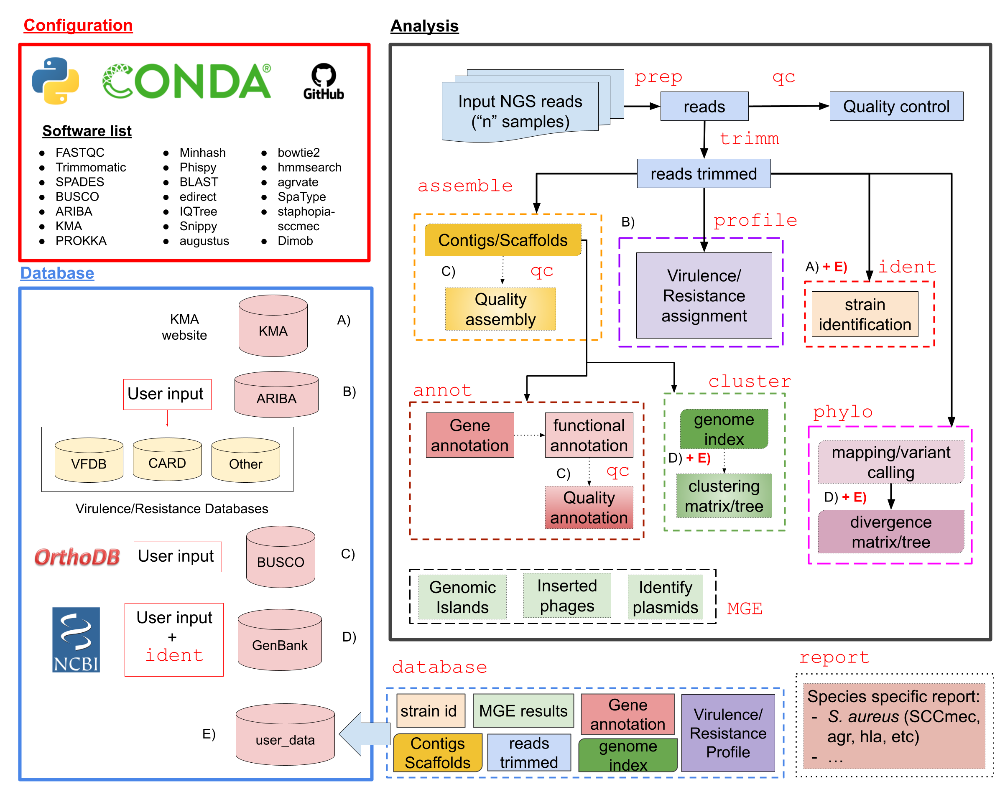

# BacterialTyper: a bioinformatics pipeline for the integrative analysis of bacterial WGS 

# Table of Contents

- [Introduction](#introduction)
- [Installation](#installation)
- [License](#license)
- [Citation](#citation)

# Introduction

We present BacterialTyper, a pipeline for the analysis of bacterial WGS data that integrates and facilitates the interpretation of results generated from multiple software analysis. It is capable of processing and identifying bacterial strains, identifying resistance and virulence genes, and generating data for outbreak analysis using WGS data from isolated microbial cultured colonies. The design of this bioinformatic tool allows comparing samples with an internal database (previously identified samples) and external databases.  

The pipeline is written in Python with a modular architecture and based on open-source software and databases engines. Multiple tasks are performed by each of several modules including: preparation of raw data; assembly and annotation; bacterial strain identification; mobile genetic elements identification (plasmids, putative pathogenicity islands or phage insertions regions); generation of a virulence and resistance profile; clustering based on sequence similarity; phylogenetic analysis; integration of metadata, etc. The tool allows to compare samples with previously identified samples (collected and internal database) but it also uses, and updates periodically, external databases from different sources. 



# Installation

To install _BacterialTyper_ you need to create a _conda_ environment with all dependendies requiere. In following weeks/months a stable _conda_ recipe will be available. 

We recommend using _mamba_ to solve all dependencies and conflicts. To install _mamba_ simply type in the base environemt:

```
conda install -c conda-forge mamba
```
Then, use mamba instead of conda to install further packages.

So far, you can either install BacterialTyper using:
- a configuration file within this git repository (**BacterialTyper/devel/conda/bacterialtyper-list.txt**). See file [here](https://github.com/HCGB-IGTP/BacterialTyper/blob/master/devel/conda/bacterialtyper-list.txt)
- or typing the following _conda_/_mamba_ command:

```
mamba create -n BacterialTyper_mamba python=3.7
conda activate BacterialTyper_mamba
mamba install -c r -c bioconda -c conda-forge trimmomatic fastqc spades=3.15.2 busco=5.1.2 ariba snippy=4.6.0 prokka=1.14.6 perl-bioperl=1.7.2 perl-bio-tools-run-alignment-tcoffee t_coffee kma=1.3.15 phispy=4.2.12 iqtree=2.1.2 r-optparse r-devtools agrvate staphopia-sccmec 
```

Then, you will need to install _BacterialTyper_ which is host in pypi [here](https://pypi.org/project/BacterialTyper/). Use _pip_ and type:

```
pip install BacterialTyper
```

This will create a working installation of _BacterialTyper_ and all dependencies.


# License

MIT License

Copyright (c) 2020-2021 HCGB-IGTP

See additional details [here](./LICENSE)

# Citation

BacterialTyper was initially described in the ECCMID 2020 Poster [1]. See and example of usage in the characterization of some clinical samples [2].

[1] Sanchez-Herrero, J.; Lacoma, A.; Molina-Moya, B.; Giménez, M.; Molinos, S.; Prat, C.; Sumoy, L. BacterialTyper: A Bioinformatics Pipeline for the Integrative Analysis of Bacterial Whole Genome Sequencing. Abstract 1981. In Proceedings of the 30th European Congress of Clinical Microbiology and Infectious Diseases, Paris, France, 18–21 April 2020

[2] A. Lacoma et al., “Genotypic and Phenotypic Characterization of Staphylococcus aureus Isolates from the Respiratory Tract in Mechanically-Ventilated Patients,” Toxins (Basel)., vol. 13, no. 2, p. 122, Feb. 2021.
