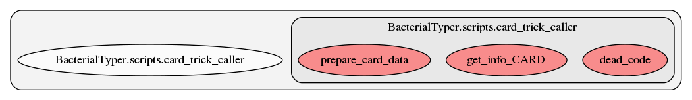

.. _card_trick_caller:

card_trick_caller
========
This script contains several functions. Here we show a graph representation of the different functions and relationships among them:

.. automodule:: BacterialTyper.scripts.card_trick_caller
    :members: echo     :undoc-members:
