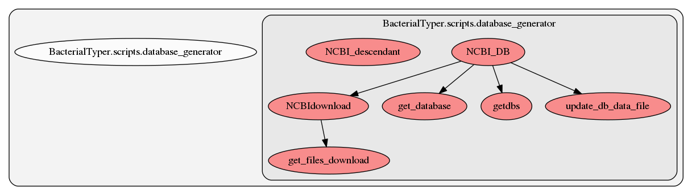

.. _database_generator:

database_generator
========
This script contains several functions. Here we show a graph representation of the different functions and relationships among them:

.. automodule:: BacterialTyper.scripts.database_generator
    :members: echo     :undoc-members:
