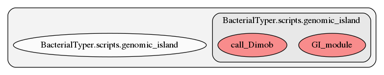

.. _genomic_island:

genomic_island
========
This script contains several functions. Here we show a graph representation of the different functions and relationships among them:

.. automodule:: BacterialTyper.scripts.genomic_island.py
    :members:
