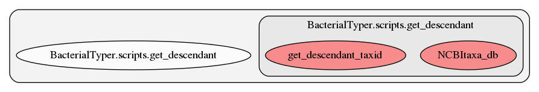

.. _get_descendant:

get_descendant
========
This script contains several functions. Here we show a graph representation of the different functions and relationships among them:

.. automodule:: BacterialTyper.scripts.get_descendant
    :members: echo     :undoc-members:
