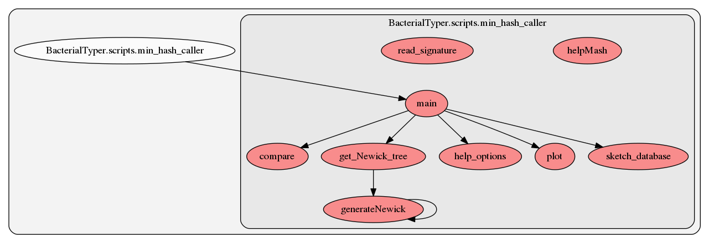

.. _min_hash_caller:

min_hash_caller
==========================================
This script contains several functions. Here we show a graph representation of the different functions and relationships among them:

.. automodule:: BacterialTyper.scripts.min_hash_caller
    :members:
    :undoc-members:

.. include:: ../../links.inc
