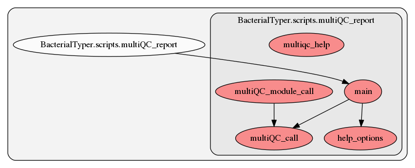

.. _multiQC_report:

multiQC_report
========
This script contains several functions. Here we show a graph representation of the different functions and relationships among them:

.. automodule:: BacterialTyper.scripts.multiQC_report.py
    :members:
