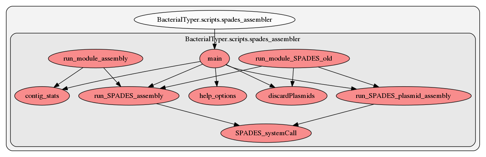

.. _spades_assembler:

spades_assembler
========
This script contains several functions. Here we show a graph representation of the different functions and relationships among them:

.. automodule:: BacterialTyper.scripts.spades_assembler.py
    :members:
