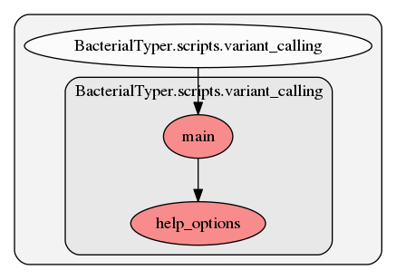

.. _variant_calling:

variant_calling
========
This script contains several functions. Here we show a graph representation of the different functions and relationships among them:

.. automodule:: BacterialTyper.scripts.variant_calling.py
    :members:
