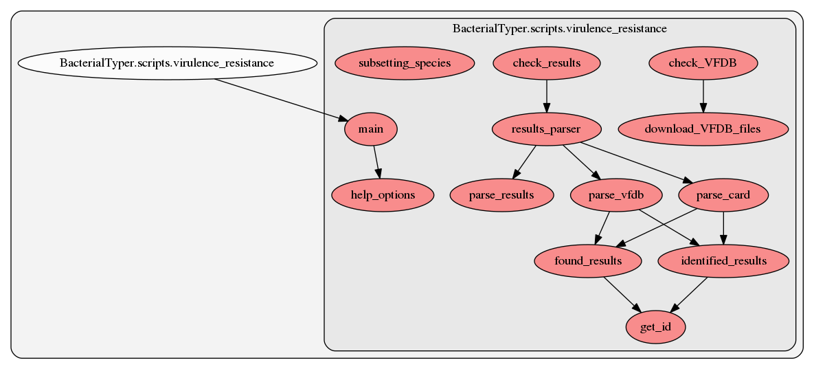

.. _virulence_resistance:

virulence_resistance
==========================================
This script contains several functions. Here we show a graph representation of the different functions and relationships among them:

.. automodule:: BacterialTyper.scripts.virulence_resistance
    :members:
    :undoc-members:

.. include:: ../../links.inc
