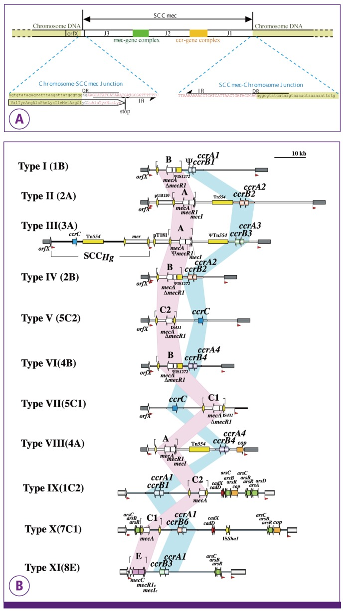

.. _sccmec-description:

SCCmec
======

The staphylococcal cassette chromosome (SCC) is a gene cassette widely disseminated
in staphylococci. SCCmec is characterized by the carriage of methicillin resistant determinant gene (mecA). 
 
Structural characteristics of SCCmec elements.
----------------------------------------------

- They carry the class A mec gene complex, consisting of mecA, its regulatory genes, mecI and mecR1, and the insertion sequence IS431.

- They carry a ccr gene complex (ccr).

- They carry two site-specific recombinase homologues.

- They have characteristic direct repeats and inverted repeats at both ends.

- They integrate into ISS (integration site sequence for SCC), which is located at 3’ end of orfX. It is located at the 3’ end of orfX.

For additional details, visit:

   http://www.staphylococcus.net
   
   http://www.staphylococcus.net/index.php/en/background
   
   http://www.staphylococcus.net/index.php/en/sccmec-descrption
   
SCCmec typing
-------------

The type of SCCmec is defined by the combination of the type of ccr-gene complex and the 
class of mec-gene complex :cite:`Hiramatsu2013`. Subtype of the SCCmec is based on the difference in the  
J regions (standing for junkyard): J1, J2, and J3.

.. csv-table::
   :header-rows: 1
   :file: sccmec_typing.csv
   

   
   Original source: Hiramatsu et. al. 2013 (PMID: 24265961)
   
   (A) **Basic structure of SCCmec**. SCCmec is bracketed by direct repeats (DRs) 
   that contain integration site sequence (ISS) recognized by cassette chromosome 
   recombinase (CCR). A pair of inverted repeats (IRs) are present at the termini of 
   SCCmec. 
   
   (B) **Various types of SCCmec**. The structures of 11 types of SCCmec are 
   illustrated based on the nucleotide sequences deposited in the DDBJ/EMBL/GenBank. 
   See original source for additional details.
   
   Direct repeats that comprise integration site sequences of SCC are located at both 
   extremities of SCCmec (the red arrowheads). The location of five (A-E) classes of 
   mec-gene complexes is indicated by pink belt. The locations of ccr-gene complexes 
   are indicated by blue belt. Insertion sequences and transposons are indicated in 
   yellow. Representative genes related to heavy metal resistance and integrated plasmids 
   located in the J regions are also indicated. Type XI is a newly identified SCCmec 
   found in the MRSA strains of bovine sources.

SCCmec database
---------------

We would use SCCmecFinder

   https://www.ncbi.nlm.nih.gov/pmc/articles/PMC5812897/
   
   https://bitbucket.org/genomicepidemiology/sccmecfinder/src/master/SCCmecFinder_v4.py
   

