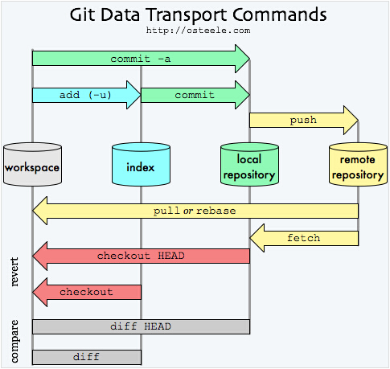

.. ################
.. _git-guidelines:
.. ################

Working with Version Control System Git
=======================================

In order to contribute and develop ``BacterialTyper`` you need to be
familiarize with the version control system (VCS) called ``git``. 
Read further details `here<https://git-scm.com/>`_.

See a summary of the main ``git`` commands in the following figure. Focus on the top commands 
which are what we would more frequently use: ``add``, ``commit``, ``push`` and ``pull``.

  
 