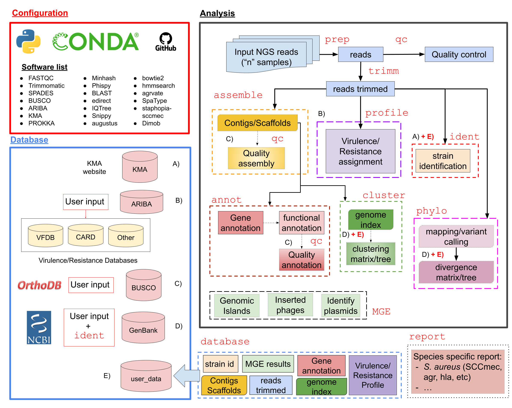

:orphan:

.. title:: BacterialTyper documentation 

BacterialTyper Documentation
****************************

.. only:: html 

    :Version: |version|
    :Date: |today|
    
Introduction
============

``BacterialTyper`` is a pipeline that integrates multiple bioinformatic tools for the analysis of bacterial 
whole genome sequence (WGS) data from isolated microbial cultured colonies. It generates genotyping information 
and facilitates the interpretation of results. 

The pipeline is written in Python_ with a modular architecture and based on open-source software and databases engines. The 
design of this bioinformatic tool allows comparing samples with an internal database (previously identified samples) 
and external databases.  

Multiple tasks are performed by several modules including: 
 - preparation of raw data
 - generation of a virulence and resistance profile 
 - bacterial strain identification
 - clustering based on sequence similarity 
 - assembly and annotation
 - mobile genetic elements identification (plasmids, putative pathogenicity islands or phage insertions regions) 
 - phylogenetic analysis
 - integration of metadata
 - preparation of resuls for integrative visualization

The tool uses and updates periodically external databases from different sources. It also allows the comparison of 
obtained results with those previously generated (internal database).

The ``BacterialTyper`` documentation includes:

- A :doc:`User's Guide <user_guide/user_guide_index>` to get started.
- An example :doc:`Tutorial <tutorial/tutorial_index>`.
- :doc:`Developer Guidelines <devel/devel_index>`.
- Additional :doc:`information <info/info_index>` of the ``BacterialTyper`` project
- A list of :doc:`Glossary <glossary/glossary_index>` terms
- A list of :doc:`Bibliography <bib/zbib_index>`

.. ##################
.. _pipeline-scheme:
.. ##################

Pipeline Scheme
===============

Here we show the scheme of the ``BacterialTyper`` bioinformatic tool. It is divided in four main actions:
   
   #. **Set the database**: Several databases are downloaded from different websites/sources. They are automatically downloaded, indexed and/or updated after several days/months.
   
   #. **Identification analysis**: for each sample of interest several bioinformatic steps are performed.
   
   #. **Populate the database**: using the information generated in the identification analysis, user database is populated for later analysis.
   
   #. **Outbreak progression analysis**: Using information in the database and samples of interest, user guides the analysis of the emergence or progression of an outbreak.

Table of Contents
=================
.. toctree::
   :maxdepth: 4

   contents.rst
 
.. include:: links.inc