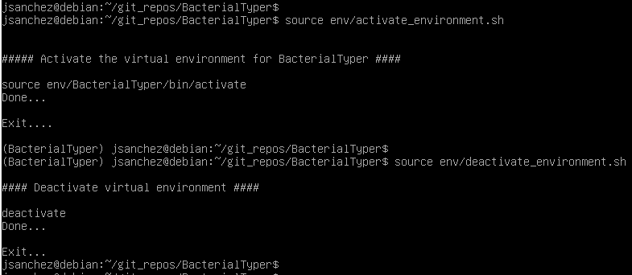

.. ################################################
.. _faqs:

Frequently Asked Questions (FAQs)
*********************************

This is a collection of FAQs for ``BacterialTyper`` tutorial and interpretation of results. 

.. seealso::

    Please read further information on each section following the links provided or
    the main :ref:`User Guide for BacterialTyper<users-guide-index>`.

Installation
============

- What is required for the installation?

In order to correctly install ``BacterialTyper``, it is necessary to have python3 and 
python development and virtual environment libraries installed. See additional details 
in section :ref:`System requirements<system-requirements>`.

- Why does the script ``env/create_python_environment.sh`` or the script ``env/activate_python_environment.sh`` report ``source`` and ``pip`` not found?

Sometimes, the script to create or activate a `python environment`_ do not execute and update the 
content of the virtual environment created. 

They usually create these error messages:

``env/create_python_environment.sh``:
   
.. code-block:: sh
   
      ``env/create_python_environment.sh: 16 env/create_python_environment.sh: source: not found``  
      ``env/create_python_environment.sh: 23 env/create_python_environment.sh: pip: not found``
   
``env/activate_python_environment.sh``:
   
.. code-block:: sh

      ``env/activate_python_environment.sh: 16 env/create_python_environment.sh: source: not found``
   
These error messages are because they are not correctly executed or they might have lost execution permissions.

To fix this error and follow with ``BacterialTyper`` installation provide execution permission using
``chmod`` and execute appropriately the shell scripts command as follows:

For the ``create_python_environment.sh`` script:

.. code-block:: sh

   chmod +x env/create_python_environment.sh
   source env/create_python_environment.sh
   
Or for the ``activate_python_environment.sh`` script:

.. code-block:: sh

   chmod +x env/activate_python_environment.sh
   source env/activate_python_environment.sh

- How do I know the python environment is activate?

Once you execute the activation of the environment, either using the script ``activate_python_environment.sh`` or 
by executing ``source env/BacterialTyper/bin/activate``, you should see a tag in the command-line header as shown in 
figure X.

Once you deactivate the environment this tag should disappear. 

Read additional details in `python environment`_ official documentation website.

Quality control
===============

- Why do raw read length values vary for each sample?

This is generally a result of the trimming generated by default in the raw data from a Illumina MiSeq run. The software 
bcl2fastq :cite:`bcl2fastq` performs basecalling and writes the sequence and quality scores into two FASTQ files per 
sample (one for R1 and one for R2), after separating demultiplexing mixed samples from the library pool by bar code indices. 

It also performs the trimming of adapter sequence in the reads beyond the genomic insert. If so, the corresponding base calls 
beyond the match will be changed to N in the resultant FASTQ file or trimmed, generating variable lengths for each read.

- Why is there a drop in quality with read length?

As an example of a Multiqc_ image of quality control of our samples, there is a progressive drop in quality with read length, 
less pronounced in R1 than in R2, causing R2 reads with lower mean base quality :cite:`Tan2019`, which is expected from 300 
nt long paired end reads

.. ######################
.. include:: ../links.inc
