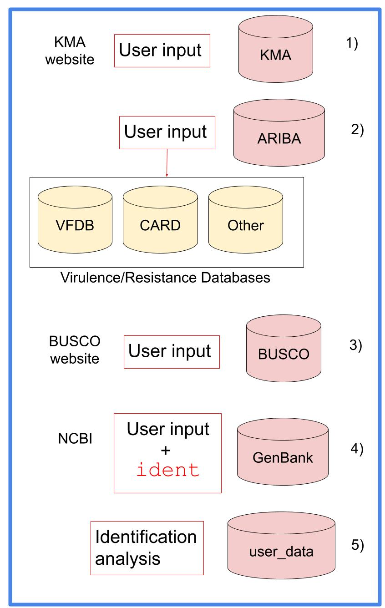

.. ############################3
.. _database-description::

database
========

BacterialTyper relies in multiples databases that are initiated and downloaded in a folder provided using the option `--database string`.

The database module contains several functions (See :doc:`database module <../../api/modules/database>` for additional details) that would configure
the retrieval, update and configuration of the different databases.

.. _databases-included:

Databases
---------

Below we show the main databases included in our database. 

.. include:: ../../links.inc
   
   