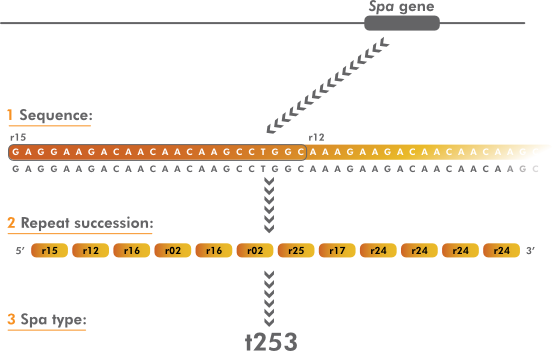

SPAtyping
=========

The spa typing method is based on sequencing of the polymorphic X region of the 
protein A gene (spa), present in all strains of Staphylococcus aureus. 
The X region is constituted of a variable number of 24-bp repeats (exceptions of 21 to 30 exist) 
flanked by well-conserved regions. Due to its repeat structure, the spa locus 
simultaneously indexes micro- and macrovariations, enabling the use of spa typing 
in both local and global epidemiological studies :cite:`Hallin2009`. 

Establishment of standardized spa type nomenclature and Internet shared databases 
is crucial for the success of this typing method. The most important and reference
database for this purpose is the SeqNet/Ridom Spa Server.

Each new base composition of the polymorphic repeat found in a strain is assigned a 
unique repeat code. The order of specific repeats for a given strain determines its spa type. 

   Original source: Applied Maths Bionumerics `website <https://www.applied-maths.com/applications/staphylococcus-aureus-spa-typing>`_. 
   First, a repeat classification is generated. Then, based on the specific repeat order the spa type is determined.

``BacterialTyper`` relies on a ``python`` module named ``spa_typing`` (https://github.com/mjsull/spa_typing) 
(developed in collaboration) that automatically synchronizes repeats and spa type signatures with the SeqNet/Ridom Spa Server.  

It automatically retrieves repeats from: http://spa.ridom.de/dynamic/sparepeats.fasta 
and spa types from http://spa.ridom.de/dynamic/spatypes.txt
 
Here we show an example of SPA repeats:

.. include:: spaRepeats_example.txt
   :literal: 
   
And an example of SPA typing:

.. csv-table::
   :header: "Spa Type", "Spa Repeat combination"
   :file: spaTypes_example.txt
   
